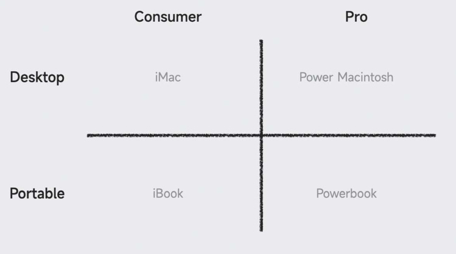

# 互联网七字诀
- >读者：杨智炜
- >时间：202509
---
> 互联网思维：专注、极致、口碑、快——互联网七字诀
---
## 专注
- “把鸡蛋尽量放在一个篮子里”——事实上，这往往才是正确的选择。

- 将有限的资源投入足够聚焦的业务线中，才可能形成最大化的竞争力，拿出足够好的产品与服务

- 专注的四个核心命题
    - 清晰的使命、愿景
    - 洞察力，了解行业，了解用户需求，找到机会
    - 明确而坚定的目标及与之匹配的能力
    - 克制贪婪，少就是多
### 边界在哪儿：清晰的使命、愿景
- 没有边界的组织必将走向盲目和混乱

- “有所为，有所不为”--真正的专注，搞清楚哪些要为，哪些不该为

- 在具体事项的讨论决策之上，需要一个组织内的终极判断依据，那就是非常明确的使命、愿景，它是一家企业/机构最本源、最核心的行动指南，是观念层面的专注，是专注领域的大边界线

- 使命，是企业/机构存在的目的和意义，是企业/机构努力为社会、大众提供的价值

- 愿景，则是基于这样的使命，企业/机构最终希望成为的样子

- 使命和愿景的总结是塑造企业**灵魂**的过程

- 使命和愿景只有经过长期实践、思考和总结才会变得清晰可见，而随着公司的成长和思考的深入，使命和愿景还可能需要再修正和完善

- 使命和愿景并非大型公司所独有，大到大型公司，小到街边小超市、饭馆

- 企业/机构，凡能够获得成功，就说明它对自身的价值和远景已经有了明确的认知与共识

- 自我审视，对自身商业模式、交付产品属性的思考和表达更加成熟
- 脱颖而出的创业公司足够锐利，因为做的事少，反而非常专注

- 跟随直觉奔跑到一定规模后，就容易迷失方向，这时，要有意识地进行收敛性思考，“公司从哪里来，又将往何处去”这一最本质命题的答案
### 克制贪婪，少就是多
- 资源总是有限的，切口越小，压强越大，突破越有力

- 收敛，专注于必要的“最小切口”，“克制贪婪”，尽量追求“单点切入”
### 一次解决一个最迫切的需求
- 不要试图用一款产品解决太多问题，能最大化满足一项迫切需求，就是巨大的成功

- 产品的切口怎么选？一开始尽量聚焦到只解决用户一个迫切的需求，这样验证起来也非常简单

- 解决的问题要一句话就可以说清楚，比如小米充电宝解决的问题就是“怎样获得大容量、质量可靠又便宜的充电宝”

- 总结：
    - 明确而且用户迫切需要的产品，更容易找到明确的用户群
    - 选择的用户需求要有一定的普遍性，这决定了产品的未来市场前景
    - 解决的问题少，开发速度快，容易控制初期的研发成本和风险
    - 解决明确问题的产品，容易跟用户说清楚，推广也会相对简单
    - 例如，2014年推出的一款爆款产品——空气净化器

- 试图用一款产品来解决很多需求，除了产品开发、推广难度大，未必能够凭借功能的数量优势赢得竞争优势，有时候甚至会误导开发者
### 决定不做什么跟决定做什么一样重要
- 用尽量少的产品满足用户最关注的需求，是一种超凡的能力

- 少就是多，背后是极为精准的行业发展与用户需求洞察、极为清晰的产品/战略思路，以及基于强大产品力的超凡自信


1997年，乔布斯重返苹果划定的产品规划四象限
### 全局“对表”，实时校验
- “克制贪婪，少就是多”，听起来是显而易见的道理，但在进入业务扩张期的公司的实际运营中，做到极不容易

- 专注，通常集中在一家公司的创业阶段或一个产品品类的开拓阶段，但专注只针对初创企业吗？显然不是

- 业务扩张与保持专注矛盾吗？不一定矛盾，关键看四个判断标准：
    - 是否符合公司的使命、愿景和战略
    - 能否与公司核心业务形成显著的强协同并形成闭环
    - 能否为用户提供一致性的价值与体验
    - 公司的资源是否支持

- 企业在推进业务多元化时，看起来有用户、有资金、有推广/渠道资源，但往往不甚成功，因在无法形成协同闭环

- 只有贯穿长期目标、始终围绕用户真实需求出发、与核心业务构成强协同的业务拓展，才能真正驱动企业发展的飞轮

- 每一项新业务的拓展都以之前业务坚实的发展模型和预期为基础，才能保证每一个发展阶段都能集中精力，专注地开拓一项业务

- 专注方面出现的问题，在一些业务中缺乏克制、业务失焦

- 解决问题的关键是“对表”，从上到下统一思路，既要有统一的专注目标，还要进行“校验”，时时检查保证不走偏
---
### 时时反问自己三个问题
- 管理领域的一条公理：
    - 组织一旦成立，就有无可抑制的自我成长的冲动和诉求
    - 对一家公司是这样，对这家公司内部的任何一支团队也是如此

- 组织的成长：
    - 通常都源于**设立的各类项目**
    - 与项目相匹配的**人力**、**资金**等各类**资源的要求**
    - 最为关键的一点：营业额或利润的增长
    - >营业额、利润一涨，往往马上会带动组织成长欲望的“局部正循环”

- 任由 **局部正循环** -> **野蛮生长**，往往并不能带来 **全局正循环**，而是 -> 一种 **近乎失控的状态**

- 乎失控的状态关键问题是：
    - 局部组织的行动方向与公司整体方向是否严格对齐？
    - 如果放任偏差，哪怕只是失之毫厘，最终也一定是谬以千里

- 战略总结：“手机+AIoT双引擎”的战略是错误的，错误的本质在于：
    - 加号连接并列的“二元业务核心结构”使得公司的战略执行出现了失焦
    - 手机业务的增长和AIoT的增长似乎成了两件事
    - AIoT相关业务群更加倾向于独立的用户数和连接数的提升，以及网站成交金额的增加
    - 迷失了“手机”和“AIoT”共同构成的“智能生活”体验的核心目标

- 799元的传统波轮产品好不好？但是，这样的产品是我们需要的吗？
    - 相比其他同行，在性能、体验上差不多，只是价格稍微厚道一些，用料品质好一点
    - 这对增进用户使用体验、为用户提供独特价值，以及建设科技生态有帮助吗？甚至，这是不是对公司品牌资产的一种稀释与浪费？
    - 一款产品的上市不只是可能多一份销售额
    - >每增加一个存货单位，开发成本、市场成本、客服/售后成本、仓储物流成本、销售运营管理成本等一系列成本都有增加
    - 公司总资源有限的情况下，团队把力气花在“用户价值增益”不明显的产品上，显然是不值得的

- 部门增长目标与集团整体目标发生了背离。分开看，每个团队各自都挺专注，但合起来一看，离专注就十万八千里了

- 内部**战略复盘**中进行集中**反思**，并重新深入的**调研**和**推演**

- 战略做新的修正升级，改为“手机×AIoT”，明确智能手机依然是核心业务，其他业务需要围绕智能手机展开，以构建智能生活的强大生态

- 加号改成乘号，首先突出核心业务，同时强调不再是“简单相加”，而是**乘数效应**

- 公司核心业务和核心方向、核心目标一定是**一元的**，不存在二元甚至多元的可能。无论是**创业阶段的“单点切入”还是业务扩张**，都是围绕一元核心展开增长飞轮的**不同阶段**而已

- 容易实现的增长未必是高质量的增长，可能是资源的不合理消耗

- 成交金额增加未必是公司体质增强了，也可能是虚胖

- 公司内，对于每一项业务，要反复问自己三个问题：
    - 业务增长为**公司核心战略**贡献了什么样的价值？
    - 业务增长是否带动了公司**包括核心业务在内的其他业务持续连带增长**？
    - 业务消耗了公司哪些资源？

- 要保持整体专注，就要进行目标分解（拆解）和持续校验

- 分解和校验的过程，也是对能力体系的检验和指导过程

- 每一个宏大愿望在实现过程中都**必然经受巨大的考验，承担巨大的痛苦**

- 合理设定一系列“关键进展目标”，一步一步地向前，是不断获得正反馈、保证始终专注不偏航的非常好的方法：
    >分解的颗粒度合适，就能极大减小跑偏的风险，也是对专注能力和方法的一次又一次训练

- 创业之初，团队规模小、极度扁平，沟通成本很低

- 发展到一定规模之后，针对复杂的业务结构、庞大的团队组织，就需要用好相关的管理沟通工具，以协助高效对齐

- 引入`OKR`（目标与关键成果法）机制
    - >英特尔公司创始人安迪·格鲁夫发明，约翰·道尔引入谷歌
    - >好处，在于全员参与、逐级分解、互相协同，每一层的O（目标）都对应分解为阶段性的几个KR（关键成果）
    - > 而上一层的KR又将有效指导下一层团队的O,而且可以跨团队组织印证协同
    - > 不同层级、不同部门之间可以依照OKR系统实时“对表”

- 还有两点提醒：
    - 第一，工具再好，用不好也是白费。专注意识真正成为**集体共识**并被认真践行，才能真正聚焦
    - 第二，反对一切教条主义，专注边缘要有灰度
        - 专注是目标一致，而不是教条地钉死有限目标
        - 核心方向一致的情况下，要留有适当的灰度和空间，这样才能释放**创新潜能**，在业务边缘始终留有**创新的空间和活力**
    - 这一条的实现，需要靠价值观和组织文化
    - 详见“工程师文化”相关章节
---
## 极致
- >极致既是一种产品观，又是竞争策略，还是经营策略

- 谷歌十诫
    - >把一件事情做到极致
    - >仅仅优秀是远远不够的

- 谷歌几乎每个产品都让用户癫狂——因为极致

- 什么叫极致？
    - >极致就是做到自己能力的极限，做到别人做不到的高度

- 在实践中，“极致”有两重含义：
    >1.心智上的无限投入，不遗余力争取最好

    >2.无限追求最优解，认知触达行业和用户需求的本质(第一性原理)

### 做到自己能力的极限
- 极致首先是一种精神与意愿，表现为心智上的无限投入，不断挑
战自己的极限

- 为了获得最出色的结果，有极强的主观能动性去探索、发现、总结 

- 在自己专注的**核心领域和方向上**，不要“差不多”，没有“够好了”，要的是“再努一把力，能不能更好”

- 有句话叫“高标准，严要求”，那么极致就是“始终更高标准，玩命更严要求”
#### 先有一颗不妥协的心
- 追求极致，说起来很容易，做起来很难

- 难的不是创造极致的过程，而是能发现很多司空见惯、熟视无睹的不美好、不完善，同时对这些不美好、不完善决不妥协、决不容忍

- 对不完美不妥协，对一切丑的、难用的产品和服务细节不容忍，并且有巨大的热情和动力去改变，这是极致的前提
#### 哪怕只好1%，也愿意多投入100%
- 对专注的核心目标不惜心力、不惜代价地投入，是实现极致突破的关键

- 比如：要让气泡水在同类健康饮品中胜出的关键是什么？代糖工艺和在口味调试方面下功夫

- 比如：小米手机引入不锈钢中框

- 哪怕只好1%，我们也愿意多付出100%

#### 别人看不到的地方也要非常好
- 沃尔特·艾萨克森所著的《史蒂夫·乔布斯传》第12章中，记载了让所有产品人都灵魂震颤的故事：
```
乔布斯从父亲身上学到，充满激情的工艺就是要确保即使是隐藏的部分也被做得很漂亮。
这种理念最极端也是最有说服力的例子之一，就是乔布斯会仔细检查印刷电路板。
电路板上是芯片和其他部件，深藏于麦金塔的内部，没有哪个用户会看到它，但乔布斯还是会从美学角度对它进行评判。
```

- 优秀的木匠不会用劣质木板去做柜子的背板，即使没人会看到

- 麦金塔电脑上市后访谈中，乔布斯再一次提到父亲对他的教导：
```
“如果你是个木匠，你要做一个漂亮的衣柜，你不会用胶合板做背板，虽然这一块是靠着墙的，没人会看见。你自己知道它就在那儿，所以你会用一块漂亮的木头去做背板。如果你想晚上睡得安稳的话，就要保证外观和质量都足够好。”
```

- 匠人文化跟工程师文化有着显著差异（本书第三部分将有论及）

- 只有对**细节的敏锐感知**和**对完美状态的孜孜以求**，才能实现**真正的极致**，创造出**超凡的作品**。
#### 改改改改再改改

